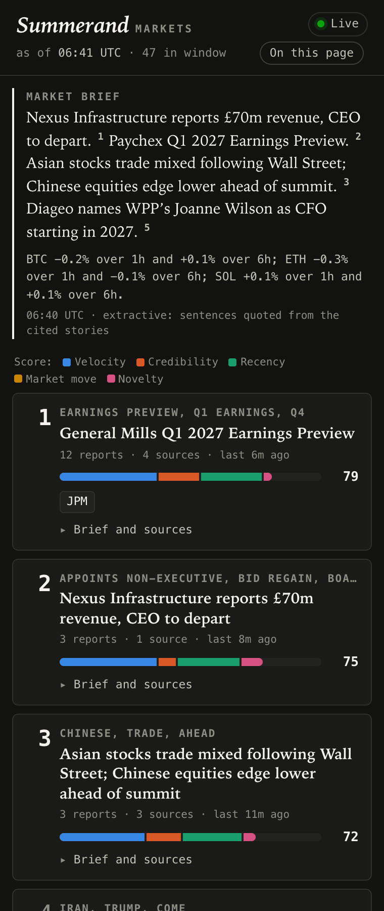
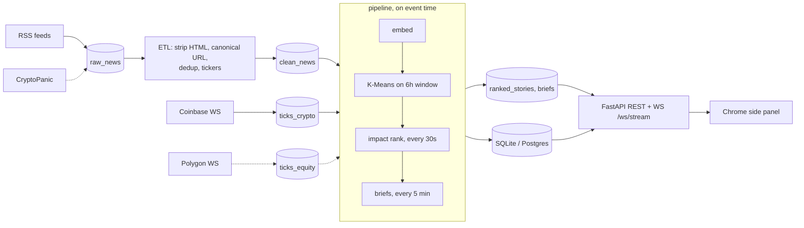

# Summerand

Market news clustering, impact ranking and briefs, streamed to a Chrome side panel.

Summerand polls financial and crypto news feeds and live market data, groups related articles
with embeddings and K-Means, scores each group for likely market impact, and writes short cited
briefs. A FastAPI server pushes the ranking over a WebSocket to a Chrome side panel, which also
highlights tickers on the page you're reading.



## Run the recorded demo

`make setup` installs the locked Python dependencies and pinned local embedding model; it needs network access. After setup, replay the included 24-hour fixture without API keys:

```sh
SUMMERAND_EMBEDDER=local SUMMERAND_LLM=off make demo-fast
```

The API serves at `http://127.0.0.1:8000`. To view the side panel, open `chrome://extensions`, enable Developer mode, choose **Load unpacked**, and select this repository's `extension` directory. The demo command replays into a local SQLite database and serves the final state until stopped. `make ext-test` runs the extension's Node tests; `make test-fast` runs the Python tests.

`make demo` replays at 300x instead (24 hours of news in about five minutes), so you can watch
clusters form and rankings change in the panel. Speed only changes how long the replay sleeps
between events; the pipeline's results are the same at any speed. `--until 2026-08-28T19:30:00Z`
stops the replay at a chosen moment (the screenshot above is from then). Without `make setup`'s model
download the demo falls back to hashed bag-of-words vectors, which cluster less well but need
nothing.

Nothing in the demo needs the network after setup. `make e2e-offline`, run under a wrapper that
blocks outbound connections, runs the demo, the tests and the extension smoke test with every
process checking at startup that it cannot reach the internet (see
[docs/verification.md](docs/verification.md)).

## How it works



In compose mode each box is its own process and the topics are Redpanda topics. In the demo
they are asyncio tasks on an in-memory bus with the same interface.

**Event time.** Nothing in the pipeline reads the wall clock. An `EventClock` only moves when the
driver releases an event, and the periodic jobs (re-cluster every 60s, rank every 30s, briefs
every 5 min) fire at their due event times in order. Events from all input topics are merged by
`(ts, seq)`. Each topic keeps its own watermark (latest event time minus 2 minutes of allowed
lateness, or an explicit watermark message), and an event is released only once every input's
watermark has passed it. Later events are counted and dropped. That is why an unpaced replay
and a 300x replay produce identical clusters, rankings and brief hashes, which a test checks.
In live mode a feed that has gone quiet (nothing queued, consumer caught up) has its watermark
moved forward from wall time so the rest can proceed.

**Embeddings.** OpenAI `text-embedding-3-small` when a key is set, otherwise all-MiniLM-L6-v2
from the pinned local copy, otherwise hashing. Each backend has an id
(`provider/model/revision/dim/preprocessing-hash`), and one index generation only ever holds
vectors from one backend. If the active backend fails, it retries with backoff and the last good
ranking is re-served flagged `stale`. After three failed syncs the whole window is re-embedded
with the next backend and swapped in as a new generation.

**Clustering.** Every 60 seconds of event time, MiniBatchKMeans is refit from scratch on the
articles published in the last 6 hours (`partial_fit` would keep pulling toward topics that have
already left the window). k is re-chosen every 10 minutes by cosine silhouette over
`[2, min(30, n/3)]`. Cluster IDs are kept stable with Hungarian matching on centroid cosine.
A match is rejected below cosine 0.8 or member overlap 0.2, so a new topic never inherits an old
topic's ID just because the cluster counts happen to line up. After an embedding-generation
switch, matching uses member overlap only. Labels are the top class-based TF-IDF terms of each
cluster's titles.

**Impact score** (`summerand/rank/impact.py`) is a weighted mean of five components in [0, 1]:

| component | weight | definition |
|---|---|---|
| velocity | 0.30 | sigmoid of a Poisson z-score: articles in the last 30 min vs. the rate over the rest of the window |
| credibility | 0.20 | mean prior of distinct sources × (1 − e^(−sources/2)); priors are hand-set in `config/sources.yaml` |
| recency | 0.20 | 60-minute half-life since the latest article |
| market move | 0.20 | absolute log return since the first report in units of σ√minutes, plus the best lag-0..5 correlation between article counts and absolute returns |
| novelty | 0.10 | 1 − max cosine to other clusters surfaced in the last 24h |

When no ticker in a cluster has price data, the market weight is dropped and the others are
rescaled. Scores are smoothed with an EMA (α = 0.5) per cluster ID.

**Briefs.** With an OpenAI key, the model gets the numbered articles plus computed price facts
("SOL −4.2% since 13:03 UTC, 12.9σ") and must cite `[n]` after every sentence. A validator
rejects any draft with an uncited sentence, a citation that doesn't exist, or a number that
doesn't appear in the input (clock times count as one token, citation markers don't license
numbers, and a signed percentage must keep its sign). Rejected drafts, and every brief when there
is no key, fall back to an extractive brief: maximal-marginal-relevance picks of the articles' own
sentences, each cited. The validator doesn't catch numbers written as words ("three") or a
direction word that contradicts an unsigned percentage ("rose 2.1%" when it fell).

Templated posts (earnings previews, price-prediction articles) are dropped by the ETL using the
`title_noise` patterns in `config/sources.yaml`. One outlet publishes dozens of them a day, and
they would otherwise dominate the velocity component.

## Live mode

`summerand live` runs everything in one process with no Kafka: RSS polling, the Coinbase ticker
WebSocket, the ETL, the pipeline and the API on `127.0.0.1:8000`. It needs network access but no
keys. Where each source stands today (details in [docs/verification.md](docs/verification.md)):

| source | status |
|---|---|
| RSS feeds in `config/sources.yaml` | 15 enabled; Reuters' crypto feed is disabled (401) |
| Coinbase ticker WebSocket and REST candles | work without a key |
| Polygon | REST minute bars work on the free plan (used for the fixture); the stocks WebSocket needs a paid plan, so `summerand ingest polygon` exits with a clear message otherwise |
| CryptoPanic | optional; its v2 developer endpoint currently answers 404, so the poller logs that once and exits |
| OpenAI | optional; without a key (or once it hits a quota error) embeddings fall back to MiniLM and briefs to extractive, and `/api/status` reports `llm: disabled (quota)` |

## Compose mode

```sh
make compose-up            # Redpanda, Postgres, RSS + Coinbase ingest, ETL, pipeline, API
docker compose --profile cryptopanic up -d ingest-cryptopanic   # optional, needs a token
make compose-demo          # the fixture replayed through Kafka instead of live feeds
make compose-offline       # the same replay on an internal-only network, checked from inside
```

The API binds to 127.0.0.1 unless given `--host` (compose passes 0.0.0.0 inside the network).
Set `SUMMERAND_EXTENSION_IDS` to pin which extension ids may connect; by default any unpacked
extension id and localhost pages are allowed. Redpanda listens on `redpanda:9092` for containers and `localhost:19092` for the host. Postgres
is published on `127.0.0.1:5433` (`SUMMERAND_PG_PORT`), and the API on `SUMMERAND_API_PORT`
(default 8000). Keys go in `.env` (see `.env.example`); all of them are optional. To use MiniLM
inside the containers, build with `SUMMERAND_EXTRAS="--extra pg --extra local"` (this adds
torch) after `make models`.

The pipeline doesn't commit offsets. On restart it rebuilds its window from the retained topics
(news kept 26h, ticks 7h). While it is catching up it doesn't call the LLM or push to clients.

## API

| endpoint | returns |
|---|---|
| `GET /api/stories?limit=&ticker=` | latest ranking: stories with score, components, tickers, moves, headline, items, brief |
| `GET /api/clusters/{id}` | a cluster's articles, label, generation and latest brief |
| `GET /api/briefs/latest` | the latest market brief |
| `GET /api/tickers/{sym}/bars?since=` | 1-minute bars |
| `GET /api/articles?ticker=` | recent articles mentioning a ticker |
| `GET /api/watchlist` | symbols, aliases and stoplist (the extension uses these) |
| `GET /healthz`, `GET /api/status` | liveness; pipeline state, embedder, late-event counts |

`WS /ws/stream` sends the latest `snapshot` and `market_brief` on connect, then `snapshot` every
30s of event time, `cluster_update` when a story's brief changes, `market_brief`, and
`heartbeat` every 15s (`ts_ms` is the data's as-of time, `wall_ms` is only for liveness). Send
`{"type": "subscribe", "tickers": ["BTC"]}` to filter. Each client has a 100-message queue; a
client that falls that far behind is disconnected.

## Extension

Manifest V3, plain JavaScript, no build step (`extension/`). The WebSocket lives in the side
panel page, because an MV3 service worker gets suspended. The content script walks text nodes
and wraps tickers in `<mark>` elements with DOM calls only. Article titles come from RSS feeds,
so nothing is ever inserted as HTML, and a test fails the build if `innerHTML` or similar shows
up. "On this page" filters the panel to stories whose tickers appear in the current tab. The
server address is set on the options page; a non-local address prompts for that host's
permission (declared as optional in the manifest). `scripts/smoke_extension.py` loads the unpacked
extension in Chromium with Playwright and checks the panel, highlighting and the offline state.

## Fixture

`fixtures/demo_feed.jsonl.gz` was recorded by `scripts/record_fixture.py` from one poll of the
feeds in `config/sources.yaml`, plus Coinbase 1-minute candles and Polygon 1-minute aggregates.
It keeps only the title, link, source, publish time and a 240-character plain-text summary of
each article. Counts per feed and symbol are in `fixtures/demo_feed.manifest.json`.
`fixtures/tiny_feed.jsonl` is synthetic (three invented stories and made-up prices) and is used
by the tests.

## Ranking evaluation

`make eval` replays the same fixture and compares the pipeline's impact order with recency, cluster size, and 200 seeded random shuffles. A story is labeled positive when a ticker's absolute 60-minute log return exceeds twice its trailing 120-minute realized one-minute volatility scaled by `sqrt(60)`. Only stories with sufficient price history and a future price enter the evaluation. The result is in [`results/ranking_eval.json`](results/ranking_eval.json); the script and fixture hashes in that file identify the evaluated inputs.

This fixture **does not establish a ranking improvement**. Only 7 of 133 snapshots with priced candidates have a positive story, and those 7 contain 1, 1, 1, 1, 5, 3, and 1 candidates. Precision at five therefore cannot vary with order in any evaluated snapshot. NDCG at ten can vary in only two. The positive snapshots are also drawn from one replay and are not independent market events. The scores are descriptive diagnostics, not evidence that impact ranking predicts price moves or beats the baselines. A useful next evaluation needs more independent positive events and multiple candidates per snapshot, with the labeling rule and comparison fixed before inspecting results.

## Limitations

- On real headlines the clusters are loose: a day of mixed market news has little cluster
  structure, and the best silhouette is far below what the synthetic test fixture gets. Bursts
  from one outlet, such as a feed of earnings previews, can rank near the top because velocity
  has the largest weight.
- Source credibility priors are hand-set.
- Most tech and finance headlines have no priced ticker, so the market-move component is often
  missing and gets renormalized away.
- Feeds change without notice: Reuters' crypto feed now returns 401, The Block moved its feed,
  and CryptoPanic's API paths changed twice (see docs/verification.md).
- Polygon's free plan has no stocks WebSocket (REST minute bars work), so live equities need a
  paid plan.
- The OpenAI embedding and LLM-brief paths are covered by tests with fakes. A live run was not
  possible because the available key had no credits (docs/verification.md).
- The pipeline is a single process per deployment and keeps its window in memory.

## Development

```sh
make setup        # network: deps, MiniLM at the pinned revision (models.lock), Playwright
make lint test    # ruff, pytest (sockets blocked except localhost), node --test
make fixture      # network: re-record the demo fixture
```

## License

MIT, see [LICENSE](LICENSE). News headlines and snippets in the fixture belong to their
publishers and are included only as short excerpts with links for testing.
